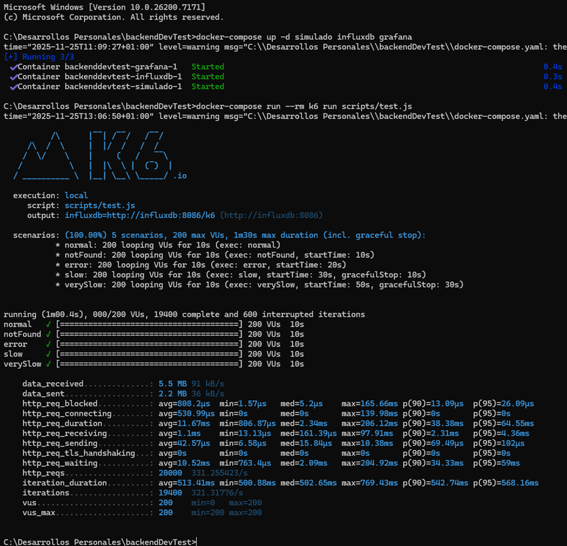
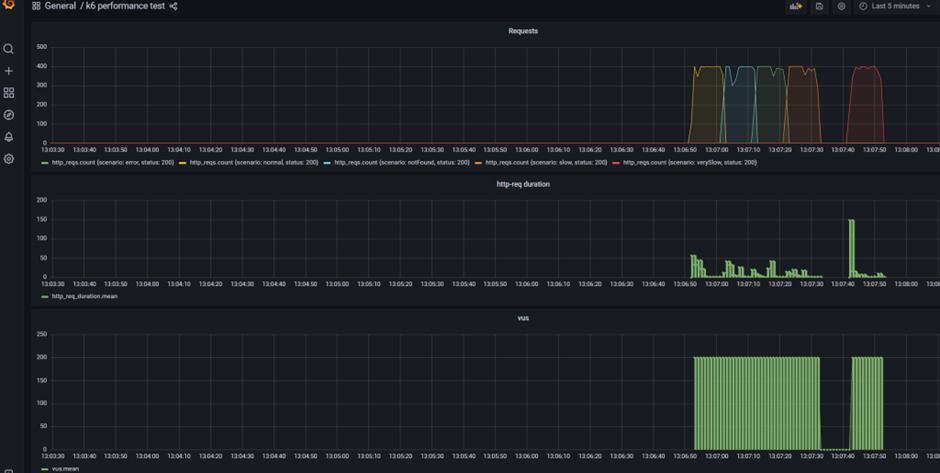

# 🛍️ Similar Products API - Backend Technical Test


## 📝 Descripción del Desafío

Esta es una implementación de la prueba técnica de backend propuesta por **Inditex**, basada en el desafío original disponible en: [github.com/dalogax/backendDevTest](https://github.com/dalogax/backendDevTest/tree/main)
```bash
  git clone https://github.com/dalogax/backendDevTest
  cd backendDevTest
  docker-compose up -d simulado influxdb grafana
```
### Objetivo

Crear un **API REST** en Java que proporcione información de productos similares a uno dado, consumiendo un servicio externo simulado y manejando de forma resiliente los fallos parciales.


# 🚀 Análisis de los endpoint proporcionados


✅ **Consumo de servicio externo simulado:**
- `GET /product/{productId}/similarids` → Lista de IDs similares
- `GET /product/{productId}` → Detalles del producto

### ✨ get-product-similarids

| Endpoint get-product-similarids                | Response | Time  | Status |
|------------------------------------------------|--|-------|--------|
| **http://localhost:3001/product/1/similarids** | [2,3,4] | 7 ms  | 200    |
| **http://localhost:3001/product/2/similarids** | [3,100,1000] | 7 ms  | 200    |
| **http://localhost:3001/product/3/similarids** | [100,1000,10000] | 10 ms | 200    |
| **http://localhost:3001/product/4/similarids** | [1,2,5] | 7 ms  | 200    |
| **http://localhost:3001/product/5/similarids** | [1,2,6] | 7 ms  | 200    |

**Esta api funciona de forma correcta sin problemas con latencias correctas y 200 OK**

### ✨ get-product-productId
| Endpoint get-product-productId      | Response | Time      | Status |
|-------------------------------------|--|-----------|-----|
| **http://localhost:3001/product/1** | {"id":"1","name":"Shirt","price":9.99,"availability":true} | 7 ms      | 200 |
| **http://localhost:3001/product/2** | {"id":"2","name":"Dress","price":19.99,"availability":true} | 6 ms      | 200 |
| **http://localhost:3001/product/3** | {"id":"3","name":"Blazer","price":29.99,"availability":false} | 107 ms    | 200 |
| **http://localhost:3001/product/4** | {"id":"4","name":"Boots","price":39.99,"availability":true} | 5 ms      | 200 |
| **http://localhost:3001/product/5** | {"message":"Product not found"} | 6 ms      | 404 |
| **http://localhost:3001/product/6** |  | 6 ms      | 500 |
| **http://localhost:3001/product/100** | {"id":"100","name":"Trousers","price":49.99,"availability":false} | 1.01 seg  | 200 |
| **http://localhost:3001/product/1000** | {"id":"1000","name":"Coat","price":89.99,"availability":true} | 5.01 seg  | 200 |
| **http://localhost:3001/product/10000** | {"id":"10000","name":"Leather jacket","price":89.99,"availability":true} | 50.01 seg | 200 |

**La API de detalle GET /product/{productId} presenta varios problemas.
Por un lado, los tiempos de respuesta aumentan a medida que el productId es más alto; por ejemplo, el ID 10000 tarda bastante más que el ID 1000.
Por otro lado, se observan errores en IDs concretos: el ID 5 devuelve un 404 y el ID 6 devuelve un 500.**

**Consideraciones de desarrollo para la nueva API:**

- La nueva API no considera tiempos extremos en sus consultas a apis externas, por lo que en el get-product-productId los tiempos que superen 6 segundos se decantaran ejemplo con el caso de http://localhost:3001/product/10000 que se demora 50 segundos.
- La API get-product-productId en sus respuestas presenta un campo “availability” con valores true/false la prueba técnica no lo considera como parámetro a filtrar, por lo que se mostraran todos los productos. En una casuística real ese campo lo podría usar el front para que ellos determinen si filtran o no por ese campo.
- Para este desarrollo, se ha  preferido optar por  timeouts + caché + degradación parcial para mantener el diseño simple y centrado en el problema. En un entorno real, este desarrollo podría ampliarse con Circuit Breaker y Retry (Resilience4j) para gestionar fallos transitorios y proteger la API de servicios downstream inestables.
- Se ha optado por un stack moderno para aprovechando las últimas características de java 21 como son los hilos virtuales, la idea es que sea un modelo imperativo y fácil de mantener.

---

## 🚀 Características de la Solución Implementada

### ✨ Funcionalidades Core

- ✅ **API REST completa** con validaciones y manejo de errores
- ✅ **Procesamiento paralelo** de productos similares con Virtual Threads
- ✅ **Resiliencia ante fallos parciales**: filtra automáticamente productos con errores (404, 500, timeout)
- ✅ **Cache** con Caffeine (TTL 5 minutos)
- ✅ **Timeouts configurables** (connect: 500ms, response: 6000ms)
- ✅ **Mensajes de errores** en formato JSON para el usuario


### 🏗️ Arquitectura

```
├── application/            → servicios
├── domain/                 → lógica del dominio
├── infrastructure/         → Adaptadores REST y configuración
│  
└── test/                   → Tests 
```
```
┌─────────────────────────────────────────────────────────┐
│                 REST API (Port 5000)                     │
│  GET /product/{productId}/similar                        │
└─────────────────────────────────────────────────────────┘
                          ↓
┌─────────────────────────────────────────────────────────┐
│            SimilarProductsController                     │
│  - Validación de entrada                                 │
│  - Manejo de respuestas                                  │
└─────────────────────────────────────────────────────────┘
                          ↓
┌─────────────────────────────────────────────────────────┐
│            SimilarProductsService                        │
│  - Lógica de negocio                                     │
│  - Procesamiento paralelo (parallelStream)               │
│  - Filtrado de productos fallidos                        │
│  - Cache (@Cacheable)                                    │
└─────────────────────────────────────────────────────────┘
                          ↓
┌─────────────────────────────────────────────────────────┐
│           SimulatedProductClient                         │
│  - Llamadas HTTP al mock externo                         │
│  - Manejo de errores HTTP (404, 5xx)                     │
│  - Conversión DTO → Domain                               │
└─────────────────────────────────────────────────────────┘
                          ↓
┌─────────────────────────────────────────────────────────┐
│           Mock Service (Port 3001)                       │
│  GET /product/{id}/similarids                            │
│  GET /product/{id}                                       │
└─────────────────────────────────────────────────────────┘
```

**Capas implementadas :**
- **Presentation**: `SimilarProductsController`, `RestExceptionHandler`
- **Application**: `SimilarProductsService`
- **Domain**: `Product`, `ProductNotFoundException`, `ExternalServiceException`
- **Infrastructure**: `SimulatedProductClient`, `RestClientConfig`

### 🔧 Stack Tecnológico

| Tecnología        
|-------------------|
| **Java 21**       
| **Spring Boot 4** |
| **Spring Web**    | 
| **Spring Cache**  | 
| **Caffeine**      |
| **Lombok**        | 
| **MapStruct**     | 
| **JUnit 5**       | 
| **Mockito**       |
| **K6**            | 
| **Grafana**       |
| **Swagger / OpenAPI**       |

---

## 📦 Instalación y Configuración

### Prerequisitos

- **Java 21** o superior 
- **Maven 3.9+** (incluido en el wrapper del proyecto)
- **Docker**
- **Mock Service** corriendo en `http://localhost:3001` ([Ver instrucciones del repo original](https://github.com/dalogax/backendDevTest/tree/main))

### Clonar el Repositorio

```bash
  git clone <repository-url>
cd similarproducts
```

### Configuración

Edita `src/main/resources/application.yml` si necesitas cambiar los valores por defecto:

```yaml
server:
  port: 5000                              # Puerto de la API

simulado:
  base-url: http://localhost:3001         # URL del mock externo
  timeouts:
    connect-ms: 500                       # Timeout de conexión
    response-ms: 6000                     # Timeout de respuesta

spring:
  threads:
    virtual:
      enabled: true                       # Virtual Threads (Java 21)
  
  cache:
    cache-names: productDetail
    caffeine:
      spec: maximumSize=1000,expireAfterWrite=5m  # Cache: 1000 entradas, TTL 5 min
```

### Compilar

```bash
# Windows
.\mvnw.cmd clean compile

# Linux/Mac
./mvnw clean compile
```

### Ejecutar Tests

```bash
# Todos los tests
.\mvnw.cmd test

# Test específico
.\mvnw.cmd test -Dtest=SimilarProductsServiceTest
```

### Levantar la Aplicación

```bash
# Con Maven Wrapper
.\mvnw.cmd spring-boot:run

# O compilar JAR y ejecutar
.\mvnw.cmd clean package
java -jar target/similarproducts-0.0.1-SNAPSHOT.jar
```

La aplicación estará disponible en: **http://localhost:5000**

---

## 🔍 Uso de la API

### Endpoint Principal

#### ✅ **GET /product/{productId}/similar**

Devuelve la lista de productos similares al producto especificado.

**Ejemplo exitoso:**

```bash
    curl http://localhost:5000/product/1/similar
```

**Respuesta 200 OK:**
```json
[
  {
    "id": "2",
    "name": "Dress",
    "price": 19.99,
    "availability": true
  },
  {
    "id": "3",
    "name": "Blazer",
    "price": 29.99,
    "availability": false
  },
  {
    "id": "4",
    "name": "Boots",
    "price": 39.99,
    "availability": true
  }
]
```

#### ❌ **Producto no encontrado (404)**

```bash
curl http://localhost:5000/product/6/similar
```

**Respuesta 404 Not Found:**
```json
{
  "timestamp": "2025-11-25T00:33:58.004",
  "status": 404,
  "error": "Not Found",
  "message": "Product not found: 6",
  "path": "/product/6/similar"
}
```


#### ⚠️ **ProductId inválido (400)**

```bash
curl http://localhost:5000/product//similar
```

**Respuesta 400 Bad Request:**
```json
{
  "timestamp": "2025-11-25T00:22:50.999",
  "status": 400,
  "error": "Bad Request",
  "message": "Product ID is required",
  "path": "/product/similar"
}
```

### ✨ Resultados de todos los Endpoints de la nueva API (Endpoint Disponibles en postman collection)

| Endpoint NEW API                           | Response | Time  | Status |
|--------------------------------------------|-|-------|--------|
| **http://localhost:5000/product/1/similar** | [{"id":"2","name":"Dress","price":19.99,"availability":true},{"id":"3","name":"Blazer","price":29.99,"availability":false},{"id":"4","name":"Boots","price":39.99,"availability":true}]| 7 ms  | 200    |
| **http://localhost:5000/product/2/similar** | [{"id":"3","name":"Blazer","price":29.99,"availability":false},{"id":"100","name":"Trousers","price":49.99,"availability":false},{"id":"1000","name":"Coat","price":89.99,"availability":true}]| 7 ms  | 200    |
| **http://localhost:5000/product/3/similar** | [{"id":"100","name":"Trousers","price":49.99,"availability":false},{"id":"1000","name":"Coat","price":89.99,"availability":true}] | 10 ms | 200    |
| **http://localhost:5000/product/4/similar** | [{"id":"1","name":"Shirt","price":9.99,"availability":true},{"id":"2","name":"Dress","price":19.99,"availability":true}] | 5 ms  | 200    |
| **http://localhost:5000/product/5/similar** | [{"id":"1","name":"Shirt","price":9.99,"availability":true},{"id":"2","name":"Dress","price":19.99,"availability":true}] | 6 ms  | 200    |
| **http://localhost:5000/product/6/similar** | {"timestamp":"2025-11-25T11:46:30.3929413","status":404,"error":"Not Found","message":"Product not found: 6","path":"/product/6/similar"} | 10 ms | 404    |
| **http://localhost:5000/product//similar** | {"timestamp":"2025-11-25T11:53:53.9973492","status":400,"error":"Bad Request","message":"Product ID is required","path":"/product/%20/similar"} | 16 ms | 400    |

### Comportamiento con Productos Fallidos

La API maneja de forma **resiliente** los productos similares que fallan:

| Product ID Base | IDs Similares | IDs Devueltos | IDs Filtrados (Razón) |
|-----------------|---------------|---------------|-----------------------|
| 1 | [2, 3, 4] | [2, 3, 4] | - |
| 2 | [3, 100, 1000] | [3, 100, 1000] | - |
| 3 | [100, 1000, 10000] | [100, 1000] | 10000 (timeout > 6s) |
| 4 | [1, 2, 5] | [1, 2] | 5 (404 not found) |
| 5 | [1, 2, 6] | [1, 2] | 6 (500 server error) |

**Ventaja:** La API **siempre responde** con los productos válidos disponibles, sin propagar errores parciales al cliente.

---

---

## 📊 Pruebas de Carga K6 - Grafana

### Configuración del Test
https://github.com/dalogax/backendDevTest/blob/main/shared/k6/test.js
### Ejecutar Test de Carga
```bash
  docker-compose run --rm k6 run scripts/test.js
```
### Resultados K6


### Resultados Grafana


### Análisis de Performance


---

## 🎯 Decisiones de Diseño

### 1. Virtual Threads (Java 21)

**Problema:** Manejar miles de requests concurrentes con bajo consumo de memoria.

**Solución:** Activar Virtual Threads en Spring Boot 4.0:
```yaml
spring:
  threads:
    virtual:
      enabled: true
```

**Beneficio:** 
- Cada request HTTP usa un Virtual Thread (muy ligero)
- Miles de threads concurrentes sin overhead de memoria
- Ideal para operaciones I/O-bound como llamadas HTTP

---

### 2. Procesamiento Paralelo con `parallelStream()`

**Problema:** Obtener detalles de múltiples productos similares secuencialmente es lento.

**Solución:** Usar `parallelStream()` combinado con Virtual Threads:
```java
return ids.parallelStream()
          .map(id -> simulatedProductClient.loadProductDetailForId(id))
          .filter(Objects::nonNull)
          .toList();
```

**Beneficio:**
- **Sin paralelismo:** 3 productos × 2 seg cada uno = **6 segundos**
- **Con paralelismo:** 3 productos en paralelo = **~2 segundos** (el más lento)

---

### 3. Resiliencia ante Fallos Parciales

**Problema:** Si un producto similar falla (404, 500, timeout), no queremos fallar toda la respuesta.

**Solución:** Capturar excepciones por producto y devolver `null`, luego filtrar:
```java
try {
    return simulatedProductClient.loadProductDetailForId(id);
} catch (ProductNotFoundException | ExternalServiceException e) {
    log.warn("Skipping similar product {}: {}", id, e.getMessage());
    return null;
}
```

**Beneficio:**
- La API **siempre responde** (aunque sea con lista parcial)
- Mejor experiencia de usuario
- Logging detallado de productos omitidos

---

### 4. Cache con Caffeine

**Problema:** Llamadas repetidas al mock externo son lentas e innecesarias.

**Solución:** Cachear resultados con `@Cacheable`:
```java
@Cacheable(cacheNames = "productDetail", key = "#productId")
public List<Product> getSimilarProducts(String productId) { ... }
```

**Configuración:**
```yaml
spring.cache.caffeine.spec: maximumSize=1000,expireAfterWrite=5m
```

**Beneficio:**
- Primera llamada: consulta al mock
- Siguientes llamadas (< 5 min): respuesta instantánea desde cache
- LRU eviction automática (máximo 1000 entradas)

---

### 5. Timeouts Configurables

**Problema:** Productos lentos pueden bloquear la respuesta indefinidamente.

**Solución:** Configurar timeouts apropiados:
```yaml
simulado:
  timeouts:
    connect-ms: 500      # Conectar al mock
    response-ms: 6000    # Esperar respuesta (permite productos lentos)
```

**Beneficio:**
- Permite productos que tardan hasta 6 segundos
- Si excede 6 segundos → timeout → se filtra automáticamente
- Balance entre tolerancia y performance

---

### 6. Manejo Global de Excepciones

**Problema:** Cada excepción necesita una respuesta HTTP apropiada.

**Solución:** `@RestControllerAdvice` con handlers específicos:

| Excepción | Status | Body | Uso |
|-----------|--------|------|-----|
| `ProductNotFoundException` | 404 | ErrorResponse | Producto base no existe |
| `ConstraintViolationException` | 400 | ErrorResponse | Validación `@NotBlank` falla |
| `NoResourceFoundException` | 400 | ErrorResponse | URL con productId vacío (`//`) |
| `ExternalServiceException` | 500 | Sin body | Error del mock externo |

**Beneficio:**
- Mensajes claros y consistentes para el usuario
- Separación de concerns (Controller no maneja errores)
- Logging centralizado

---


---

## 📚 Documentación Adicional

### Archivos de Documentación


- **[similarProducts.yaml](similarProducts.yaml)**: Especificación OpenAPI del contrato de la API
- **[APIS backendDevTest.postman_collection.json](similarProducts.yaml)**: Colección Postman para probar la API
- http://localhost:5000/v3/api-docs **(OpenAPI JSON)**
- http://localhost:5000/v3/api-docs.yaml **(OpenAPI YAML)** para herramientas externas
- http://localhost:5000/swagger-ui/index.html**: Interfaz Swagger UI para probar la API


---


## 🚧 Mejoras Futuras

### Funcionalidades

- [ ] **Circuit Breaker (Resilience4j)**: Implementar en Prod para prevenir cascada de fallos si el mock está caído
- [ ] **API Versioning**: `/v1/product/{id}/similar` para futuras versiones

### Observabilidad

- [ ] **Dashboards con Grafana**: Agregar más paneles personalizados 
- [ ] **Agregar Obervsabilidad (log, metricas y trazas distribuidas)**: OpenTelemetry, Jaeger , Loki, Prometehus. En el siguiente enlace puedes encontrar una Arquitectura de Observabilidad https://github.com/cveran/observability


---

## 📄 Licencia

Este proyecto es una prueba técnica y su uso está limitado a fines educativos y de evaluación.

---

## 👤 Autor

**Prueba Técnica:** Dev Backend
**Nombre:** Christian Vera Naguelquin
**correo:** christian.vera.nag@gmail.com
**Repositorio Original:** [github.com/dalogax/backendDevTest](https://github.com/dalogax/backendDevTest/tree/main)  
**Implementación:** Similar Products API con Java 21 + Spring Boot 4.0 + Virtual Threads  
**Fecha:** Noviembre 2025

---


